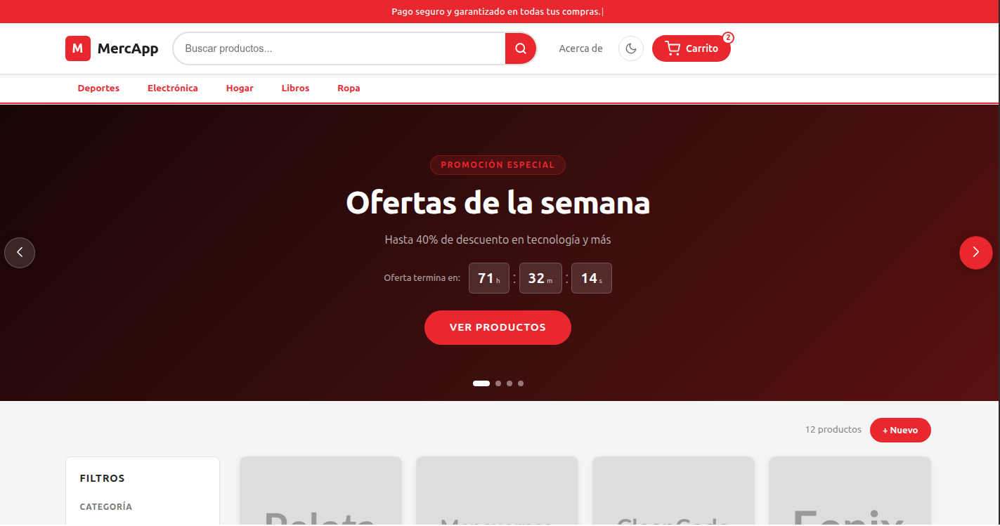
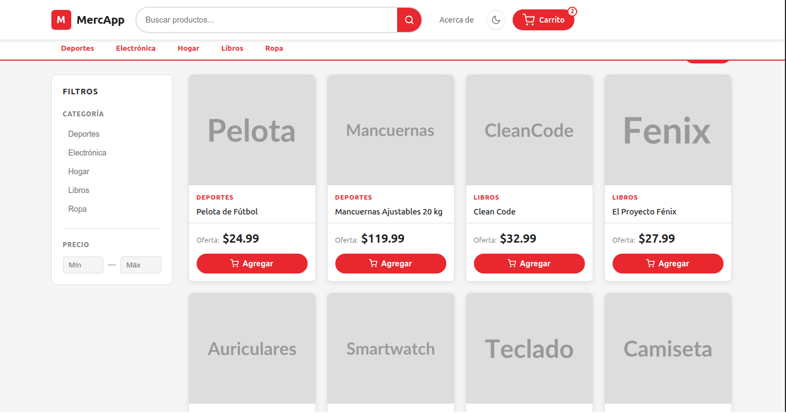
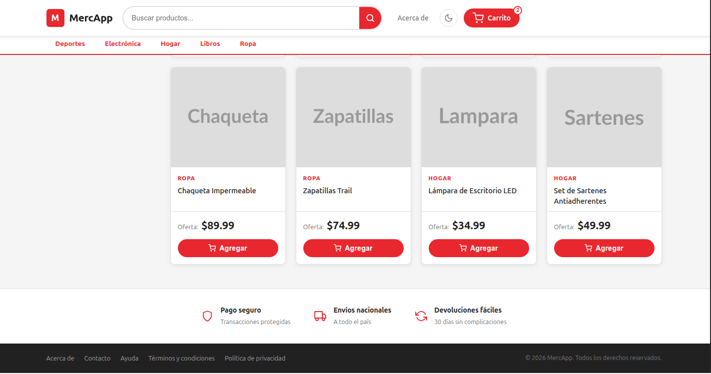
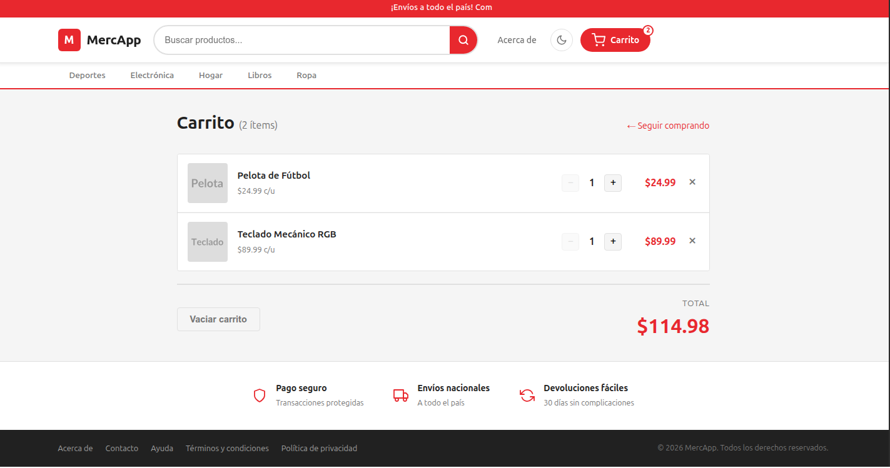
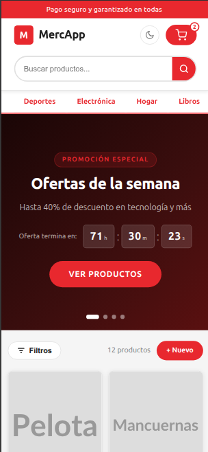
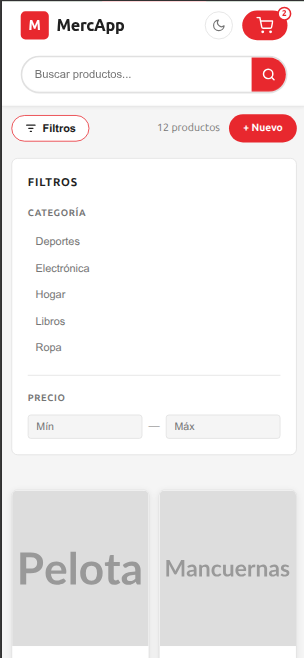
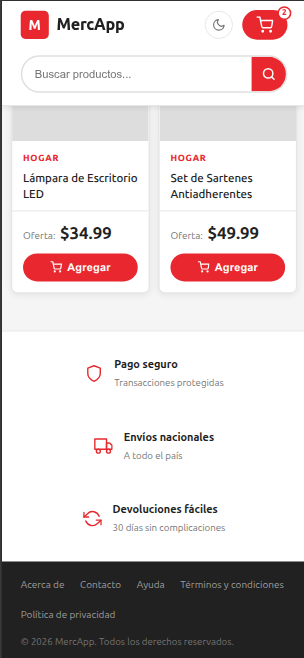
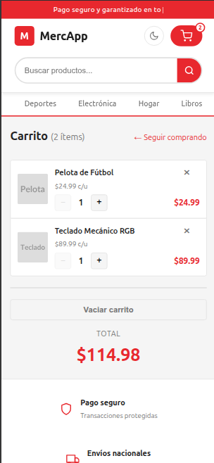

# MercApp

Aplicación de comercio electrónico de página única (SPA) construida con Vue 3 en el frontend y Express en el backend. Permite explorar un catálogo de productos, filtrarlos por categoría o precio, ver el detalle de cada uno y gestionarlos a través de un CRUD completo.


## Datos del Estudiante

| Campo | Detalle |
|---|---|
| Nombre | Jorge Rivera |
| Correo | jriveray@est.ups.edu.ec |
| Materia | Aplicaciones Web |
| Ciclo | Cuarto Ciclo |
| Institución | Universidad Politécnica Salesiana (UPS) |


**Repositorio:** [https://github.com/jorgerivera12/MercAppV1.git](https://github.com/jorgerivera12/MercAppV1.git)

---

## Capturas de pantalla

### Vista de escritorio

| Hero & navegación | Catálogo con filtros |
|:-----------------:|:--------------------:|
|  |  |

| Grid de productos & footer | Carrito de compras |
|:--------------------------:|:------------------:|
|  |  |

---

### Vista móvil

| Hero & navegación | Catálogo con filtros |
|:-----------------:|:--------------------:|
|  |  |

| Grid de productos & footer | Carrito de compras |
|:--------------------------:|:------------------:|
|  |  |

---

## Arquitectura general

```
MercApp/
├── backend/      REST API (Node.js + Express)
└── frontend/     SPA (Vue 3 + Vite)
```

El frontend corre en el puerto **5173** (Vite dev server) y hace proxy de todas las peticiones `/api/*` hacia el backend en el puerto **3000**. En producción ambos pueden servirse desde el mismo origen.

---

## Stack tecnológico

| Capa      | Tecnología                        | Versión  |
|-----------|-----------------------------------|----------|
| Frontend  | Vue 3 (Composition API)           | ^3.5     |
| Frontend  | Vue Router                        | ^5.0     |
| Frontend  | Vite                              | ^5.0     |
| Frontend  | Swiper.js                         | ^11.0    |
| Frontend  | SweetAlert2                       | ^11.0    |
| Backend   | Node.js + Express                 | ^5.2     |
| Backend   | hashids                           | ^2.3     |
| Base de datos | JSON plano (`data/db.json`)   | —        |

---

## Estructura de directorios

```
MercApp/
│
├── backend/
│   ├── app.js                      Configura Express, middlewares, rutas y Socket.io
│   ├── seed.js                     Puebla la BD con categorías, productos y usuario admin
│   │
│   ├── config/
│   │   └── database.js             Conecta a MongoDB vía MONGO_URI
│   │
│   ├── controllers/
│   │   ├── api/                    Handlers JSON — responden con res.json()
│   │   │   ├── cartController.js   GET/POST/PUT/DELETE del carrito en sesión
│   │   │   ├── categoryController.js  Listado y gestión de categorías
│   │   │   └── productController.js   CRUD completo de productos
│   │   │
│   │   └── web/                    Handlers SSR — responden con res.render()
│   │       ├── authController.js   Registro, login y logout
│   │       ├── indexController.js  Dashboard y perfil de usuario
│   │       └── productController.js  CRUD de productos (vistas Handlebars)
│   │
│   ├── middleware/
│   │   ├── autenticado.js          Protege rutas web; redirige a /login si no hay sesión
│   │   ├── upload.js               Multer — guarda imágenes en uploads/
│   │   ├── validarAuth.js          Reglas express-validator para registro y login
│   │   └── validarProducto.js      Reglas express-validator para el formulario de producto
│   │
│   ├── models/
│   │   ├── Categoria.js            Schema Mongoose de categoría
│   │   ├── Producto.js             Schema Mongoose de producto (ref a Categoria)
│   │   └── Usuario.js              Schema Mongoose de usuario (bcrypt pre-save)
│   │
│   ├── routes/
│   │   ├── api/                    Prefijo /api — devuelven JSON
│   │   │   ├── cart.js             /api/cart
│   │   │   ├── categories.js       /api/categories
│   │   │   └── products.js         /api/products
│   │   │
│   │   └── web/                    Sin prefijo — renderizan vistas
│   │       ├── auth.js             /login, /registro, /logout
│   │       ├── index.js            /, /perfil
│   │       └── products.js         /productos
│   │
│   ├── services/                   Lógica de negocio; los controllers no tocan modelos directamente
│   │   ├── authService.js          CRUD de usuarios y comparación de contraseña
│   │   ├── cartService.js          Manejo del carrito en sesión Express
│   │   ├── categoryService.js      Consultas y serialización de categorías
│   │   └── productService.js       Consultas, validación y serialización de productos
│   │
│   ├── socket/
│   │   └── chat.js                 Lógica completa de chat en tiempo real (Socket.io)
│   │
│   ├── utils/                      Funciones puras — sin Express, sin side effects
│   │   ├── mongo.js                isValidId — validación de ObjectId compartida
│   │   ├── serializers.js          Mapeo de docs Mongoose al shape público de la API
│   │   └── validators.js           Validación y traducción de campos para productos
│   │
│   ├── public/
│   │   ├── css/style.css           Estilos del panel web
│   │   └── js/                     Scripts del cliente (chat, main)
│   │
│   ├── uploads/                    Imágenes subidas por el usuario (servidas como estáticos)
│   │
│   └── views/                      Plantillas Handlebars (SSR)
│       ├── layouts/
│       │   ├── main.hbs            Layout principal (navbar + sidebar)
│       │   └── auth.hbs            Layout de autenticación (centrado)
│       ├── partials/
│       │   ├── chat.hbs            Widget de chat en tiempo real
│       │   └── errores.hbs         Partial reutilizable de mensajes de error
│       ├── auth/
│       │   ├── login.hbs
│       │   └── registro.hbs
│       ├── productos/
│       │   ├── lista.hbs
│       │   ├── nuevo.hbs
│       │   └── editar.hbs
│       ├── index.hbs               Dashboard con estadísticas de inventario
│       └── perfil.hbs              Perfil de usuario y cambio de contraseña
│
└── frontend/
    ├── index.html
    ├── vite.config.js              Alias @ → src/, proxy /api → localhost:3000
    │
    └── src/
        ├── main.js                 Punto de entrada Vue
        ├── App.vue                 Raíz: AppNav + RouterView (Suspense) + AppFooter
        │
        ├── api/
        │   └── index.js            Capa HTTP centralizada (fetch wrapper)
        │
        ├── assets/
        │   └── css/main.css        Variables CSS globales, tema claro/oscuro, tipografía
        │
        ├── router/
        │   └── index.js            Definición de rutas con lazy-loading
        │
        ├── components/
        │   ├── AppNav.vue          Topbar typewriter + navbar + barra de categorías
        │   ├── AppFooter.vue       Barra de confianza + pie de página
        │   ├── AppLoader.vue       Indicador de carga (fallback Suspense)
        │   └── ProductCard.vue     Tarjeta de producto del catálogo
        │
        ├── composables/
        │   ├── useApi.js           Wrapper reactivo para peticiones async (loading/error/data)
        │   ├── useCart.js          Estado global del carrito (localStorage, singleton)
        │   ├── useCartAlert.js     Toast SweetAlert2 al agregar al carrito
        │   ├── useCategories.js    Cache singleton de categorías (compartida entre componentes)
        │   ├── useProductForm.js   Estado + validación del formulario de producto
        │   ├── useProducts.js      Catálogo reactivo con filtros q y categoryId
        │   └── useRecentlyViewed.js  Historial de productos vistos (localStorage, máx. 5)
        │
        └── views/
            ├── HomeView.vue          Catálogo: carrusel hero, sidebar de filtros, grid, historial
            ├── ProductDetailView.vue Detalle individual con botón "Añadir al carrito"
            ├── ProductFormView.vue   Formulario de creación y edición de productos
            ├── CartView.vue          Resumen del carrito con cantidades y total
            ├── AboutView.vue         Página institucional
            └── NotFoundView.vue      404 genérico
```

---

## Rutas de la SPA

| Ruta                  | Vista                  | Descripción                              |
|-----------------------|------------------------|------------------------------------------|
| `/`                   | HomeView               | Catálogo principal con filtros           |
| `/product/new`        | ProductFormView        | Crear nuevo producto                     |
| `/product/:id`        | ProductDetailView      | Detalle de producto                      |
| `/product/:id/edit`   | ProductFormView        | Editar producto existente                |
| `/cart`               | CartView               | Carrito de compras                       |
| `/about`              | AboutView              | Acerca de MercApp                        |

Los parámetros de filtro se pasan como query params:

| Query param   | Ejemplo                        | Efecto                        |
|---------------|--------------------------------|-------------------------------|
| `categoryId`  | `/?categoryId=Wl85Vd`          | Filtra por categoría (ID codificado) |
| `q`           | `/?q=auriculares`              | Búsqueda por nombre/descripción |

---

## API REST (backend)

Base URL: `http://localhost:3000/api`

> Todos los IDs expuestos en URLs y en respuestas JSON están codificados con **hashids** (ver sección de seguridad). Los IDs numéricos nunca salen del servidor.

### Productos — `/api/products`

| Método   | Ruta              | Descripción                              |
|----------|-------------------|------------------------------------------|
| `GET`    | `/products`       | Listar productos. Acepta `?categoryId=` y `?q=` |
| `GET`    | `/products/:id`   | Obtener un producto por ID codificado    |
| `POST`   | `/products`       | Crear producto                           |
| `PUT`    | `/products/:id`   | Reemplazar producto completo             |
| `PATCH`  | `/products/:id`   | Actualizar campos parcialmente           |
| `DELETE` | `/products/:id`   | Eliminar producto                        |

**Cuerpo esperado en POST/PUT:**

```json
{
  "name": "Auriculares Bluetooth",
  "description": "Texto descriptivo",
  "price": 49.99,
  "categoryId": "2VLO09",
  "stock": 15,
  "imageUrl": "https://ejemplo.com/img.jpg"
}
```

### Categorías — `/api/categories`

| Método | Ruta           | Descripción              |
|--------|----------------|--------------------------|
| `GET`  | `/categories`  | Listar todas las categorías |

**Respuesta:**

```json
[
  { "id": "2VLO09", "name": "Electrónica" },
  { "id": "kPx8Mq", "name": "Ropa" }
]
```

### Modelo de datos interno (`db.json`)

```json
{
  "categories": [
    { "id": 1, "name": "Electrónica" }
  ],
  "products": [
    {
      "id": 1,
      "name": "Auriculares Bluetooth",
      "description": "...",
      "price": 49.99,
      "categoryId": 1,
      "stock": 15,
      "imageUrl": "https://..."
    }
  ]
}
```

---

## Composables destacados

### `useCart` — carrito global

Singleton a nivel de módulo, persistido en `localStorage`. No requiere backend.

```js
const { items, itemCount, total, addItem, removeItem, updateQuantity, clearCart } = useCart()
```

### `useCategories` — cache compartida

Garantiza que solo se haga una petición a `/api/categories` sin importar cuántos componentes lo usen (AppNav, HomeView, ProductFormView).

```js
const { categories, load } = useCategories()
onMounted(() => load())
```

### `useRecentlyViewed` — historial de productos

Almacena hasta 5 productos visitados en `localStorage`. Se actualiza desde `ProductDetailView` al cargar cada producto.

```js
const { recentlyViewed, track } = useRecentlyViewed()
track(product) // agrega o mueve al frente
```

---

## Seguridad: ofuscación de IDs

Los IDs numéricos de la base de datos nunca se exponen al cliente. El módulo `backend/lib/hashids.js` utiliza la biblioteca **hashids** con salts distintos para productos y categorías:

```
/product/1        →   /product/Wl85Vd
?categoryId=3     →   ?categoryId=2VLO09
```

- El salt vive únicamente en el servidor (o en la variable de entorno `HASH_SALT`).
- Los IDs codificados son el contrato público entre cliente y servidor.
- El frontend los trata como strings opacos: los recibe de la API y los reenvía sin modificarlos.

---

## Puesta en marcha

### Requisitos

- Node.js ≥ 18
- MongoDB corriendo localmente (o URI remota)
- npm (backend) / pnpm (frontend)

### 1. Clonar el repositorio

```bash
git clone https://github.com/jorgerivera12/MercAppV1.git
cd MercAppV1
```

### 2. Backend

```bash
cd backend
npm install
```

Crear el archivo de variables de entorno:

```bash
cp .env.example .env
```

Editar `.env` con tus valores:

```env
MONGO_URI=mongodb://127.0.0.1:27017/mercapp
PORT=3000
SESSION_SECRET=cambia_esto_por_un_secreto_seguro
```

Poblar la base de datos con datos de prueba (categorías, productos y usuario admin):

```bash
npm run seed
```

El script es idempotente: puede ejecutarse varias veces sin duplicar datos. Al finalizar habrá:

- 5 categorías y 12 productos de muestra
- Un usuario administrador listo para iniciar sesión:

| Campo      | Valor            |
|------------|------------------|
| Email      | admin@gmail.com  |
| Contraseña | 123456           |

> Si el usuario ya existía, el seed lo elimina y lo vuelve a crear con la contraseña indicada.

Iniciar el servidor:

```bash
npm run dev        # nodemon — recarga automática en puerto 3000
# o en producción:
npm start
```

### 3. Frontend

```bash
cd frontend
pnpm install
pnpm dev           # Vite dev server en puerto 5173
```

Abrir [http://localhost:5173](http://localhost:5173). El proxy de Vite redirige `/api/*` al backend automáticamente.

---

## Variables de entorno (backend)

| Variable         | Ejemplo                              | Descripción                              |
|------------------|--------------------------------------|------------------------------------------|
| `MONGO_URI`      | `mongodb://127.0.0.1:27017/mercapp`  | URI de conexión a MongoDB                |
| `PORT`           | `3000`                               | Puerto donde escucha Express             |
| `SESSION_SECRET` | `un_secreto_seguro`                  | Clave para firmar las cookies de sesión  |

Crear un archivo `.env` en `backend/` a partir de `.env.example`. Nunca commitear el `.env` real.

---

## Decisiones de diseño

- **JSON como base de datos**: apropiado para el alcance del proyecto; `lib/db.js` encapsula la lectura y escritura para que sea fácil migrar a una BD real.
- **Carrito client-side**: el estado del carrito vive en `localStorage` usando el composable `useCart`. No requiere sesión ni autenticación.
- **IDs codificados en capa de ruta**: el decode/encode ocurre solo en los handlers de Express; el resto del backend (validaciones, DB) trabaja siempre con enteros.
- **Singleton de categorías**: `useCategories` usa una variable a nivel de módulo para evitar peticiones duplicadas cuando múltiples componentes necesitan la lista.
- **Lazy-loading de vistas**: todas las vistas excepto `HomeView` se cargan bajo demanda con `defineAsyncComponent` / imports dinámicos.
